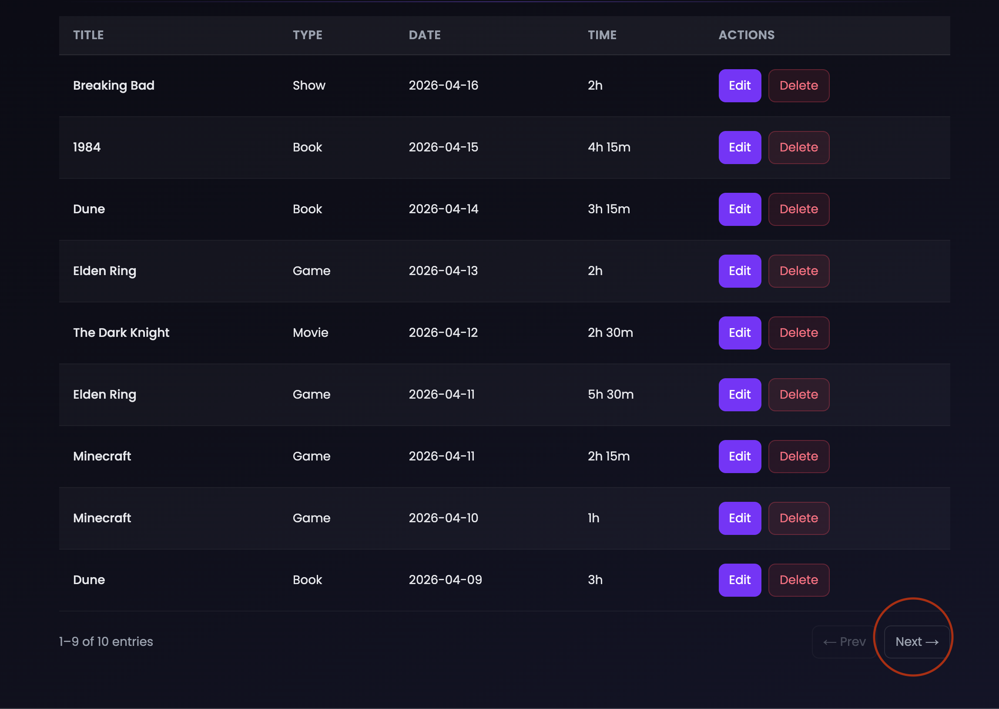
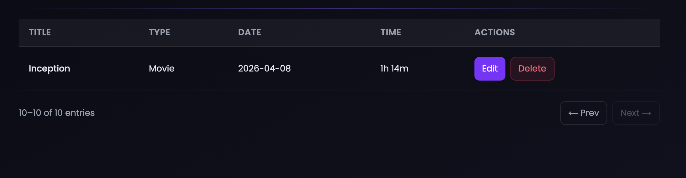

# Report 1: Paginated Journal Entries

## What it shows

The user's consumption logs in pages of 10, along with a total count of all their entries. The total is used to calculate how many pages exist and to display the "X–Y of Z entries" summary.

## Query

```sql
-- Total count (aggregation)
SELECT COUNT(cl.log_id)
FROM consumption_log cl
JOIN media_item mi ON cl.media_id = mi.media_id
WHERE cl.user_id = :user_id
  AND cl.media_id IS NOT NULL;

-- Paginated fetch
SELECT cl.*, mi.title, mi.media_type
FROM consumption_log cl
JOIN media_item mi ON cl.media_id = mi.media_id
WHERE cl.user_id = :user_id
  AND cl.media_id IS NOT NULL
ORDER BY cl.date_consumed DESC
LIMIT 10 OFFSET :offset;
```

`consumption_log` is joined to `media_item` so each row includes the title and type. `COUNT` runs first to get the total, then the paginated fetch uses `LIMIT` and `OFFSET` to return only the current page.

## Sample output

| log_id | title              | media_type | date_consumed | time_consumed |
|--------|--------------------|------------|---------------|---------------|
| 14     | Inception          | Movie      | 2025-04-10    | 148           |
| 13     | Breaking Bad       | Show       | 2025-04-08    | 60            |
| 12     | Elden Ring         | Game       | 2025-04-05    | 120           |
| ...    | ...                | ...        | ...           | ...           |

## Screenshot

<!-- Add screenshot here -->



## Why it's useful

Without pagination, a user with hundreds of entries would receive them all at once, making the page slow and hard to navigate. The `COUNT` aggregation enables the UI to show page position ("Page 2 of 5") and disable the Next button on the last page.
