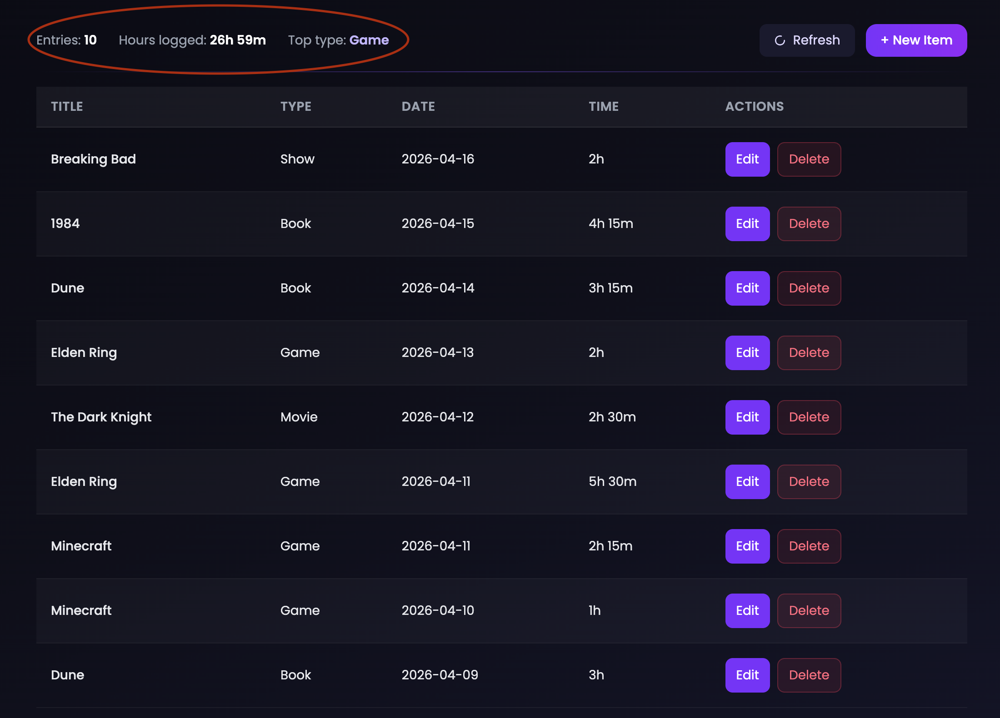

# Report 2: Top Media Type

## What it shows

Which media type the user has logged the most, by joining their consumption logs to the media catalog and grouping by type.

## Query

```sql
SELECT
    mi.media_type,
    COUNT(cl.log_id) AS n
FROM consumption_log cl
JOIN media_item mi ON cl.media_id = mi.media_id
WHERE cl.user_id = :user_id
GROUP BY mi.media_type
ORDER BY n DESC
LIMIT 1;
```

`consumption_log` is joined to `media_item` to get the type for each log entry. Rows are grouped by `media_type` and counted — the type with the highest count is returned. The result appears in the stats bar as **Top type**.

## Sample output

| media_type | n  |
|------------|----|
| Movie      | 12 |

## Screenshot



## Why it's useful

Surfaces the user's dominant media habit without them having to count manually. It refreshes every time an entry is added or deleted, so it always reflects the current state of the journal.
