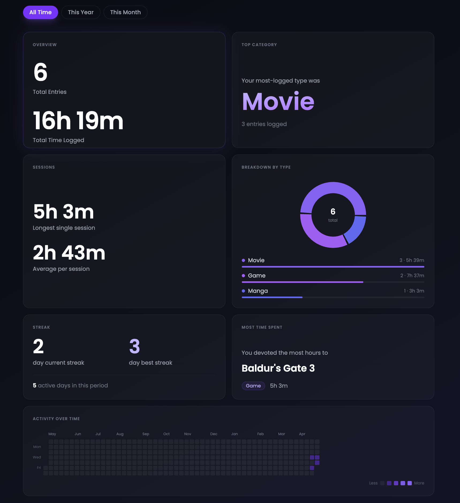

# Report 3: Wrapped

## What it shows

The user's media consumption summarized for a chosen period (All Time, This Year, This Month) - total entries, total time, top type, most time-spent item, session stats, a type breakdown donut chart, streaks, and an activity heatmap.

All data comes from `GET /logs/wrapped?period=<period>`, which runs six queries against `consumption_log`. Every query shares this base filter:

```sql
WHERE cl.user_id = :user_id
  AND cl.media_id IS NOT NULL
  -- AND EXTRACT(year  FROM cl.date_consumed) = :year   (this_year / this_month)
  -- AND EXTRACT(month FROM cl.date_consumed) = :month  (this_month only)
```

---

## Queries

### 1. Totals

```sql
SELECT COUNT(log_id), SUM(time_consumed)
FROM consumption_log
WHERE user_id = :user_id AND media_id IS NOT NULL;
```

Feeds the **Overview** card — total entries and total time logged.

---

### 2. Top media type

```sql
SELECT mi.media_type, COUNT(cl.log_id) AS n
FROM consumption_log cl
JOIN media_item mi ON cl.media_id = mi.media_id
WHERE cl.user_id = :user_id AND cl.media_id IS NOT NULL
GROUP BY mi.media_type
ORDER BY n DESC
LIMIT 1;
```

Feeds the **Top Category** card.

---

### 3. Most time-spent item

```sql
SELECT mi.title, mi.media_type, SUM(cl.time_consumed) AS total_minutes
FROM consumption_log cl
JOIN media_item mi ON cl.media_id = mi.media_id
WHERE cl.user_id = :user_id AND cl.media_id IS NOT NULL
GROUP BY mi.media_id, mi.title, mi.media_type
ORDER BY total_minutes DESC
LIMIT 1;
```

Feeds the **Most Time Spent** card.

---

### 4. Type breakdown

```sql
SELECT mi.media_type, COUNT(cl.log_id) AS count, SUM(cl.time_consumed) AS minutes
FROM consumption_log cl
JOIN media_item mi ON cl.media_id = mi.media_id
WHERE cl.user_id = :user_id AND cl.media_id IS NOT NULL
GROUP BY mi.media_type
ORDER BY count DESC;
```

Feeds the **Breakdown by Type** donut chart and bar legend.

---

### 5. Longest session

```sql
SELECT MAX(time_consumed)
FROM consumption_log
WHERE user_id = :user_id AND media_id IS NOT NULL;
```

Feeds the **Sessions** card. Average per session is derived client-side as `total_minutes / total_entries`.

---

### 6. Activity by day

```sql
SELECT date_consumed, COUNT(log_id) AS count
FROM consumption_log
WHERE user_id = :user_id AND media_id IS NOT NULL
GROUP BY date_consumed
ORDER BY date_consumed;
```

Feeds the **Activity heatmap**. Streak stats (current, best, active days) are computed client-side from this data.

---

## Sample output

**Totals**
| total_entries | total_minutes |
|---|---|
| 47 | 4320 |

**Top media type**
| media_type | n |
|---|---|
| Movie | 18 |

**Most time-spent item**
| title | media_type | total_minutes |
|---|---|---|
| Elden Ring | Game | 980 |

**Type breakdown**
| media_type | count | minutes |
|---|---|---|
| Movie | 18 | 2160 |
| Game | 12 | 1440 |
| Show | 10 | 600 |
| Anime | 7 | 120 |

**Activity by day (excerpt)**
| date_consumed | count |
|---|---|
| 2025-03-01 | 2 |
| 2025-03-04 | 1 |
| 2025-03-05 | 3 |

## Screenshot



## Why it's useful

Rather than scrolling through individual log entries, users get a much more visually appealing perspective on how much they've watched, read, or played over a week, month, or year, and which types of media dominate their time. It turns a long history of raw entries into something actually readable at a glance.
